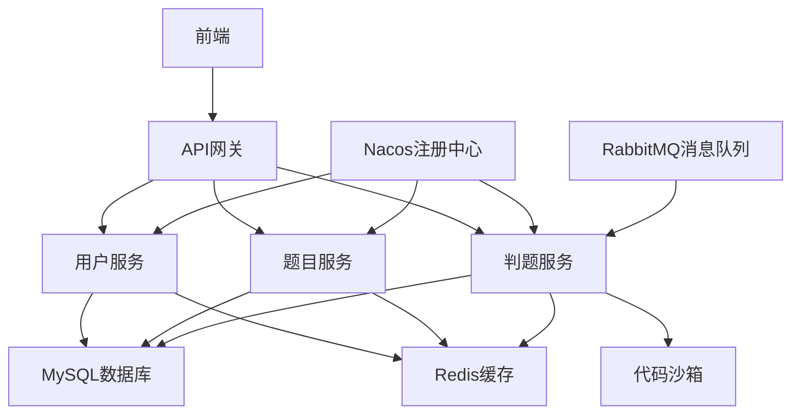

# ChengOJ 在线编程判题系统 - 微服务版


## 📖 项目简介

ChengOJ 是一个基于微服务架构的在线编程判题系统，支持多种编程语言的代码提交和自动判题功能。系统采用 Spring Cloud Alibaba 微服务架构，提供高可用、高并发的在线编程体验。

## 🌐 在线体验

**线上地址：** [http://117.72.100.85:8080](http://117.72.100.85:8080)

> 🎯 您可以直接访问上述地址体验完整的在线判题功能，无需本地部署！

## 🏗️ 系统架构



## ⚡ 核心功能

### 👤 用户管理
- 用户注册、登录、退出
- 用户信息管理
- 权限控制（user/admin/ban）
- 用户行为统计

### 📝 题目管理
- 题目的增删改查
- 题目标签分类
- 题目难度设置
- 判题用例配置
- 题目提交统计

### 🔍 判题系统
- 多语言支持（Java、Python、C++等）
- 安全的代码沙箱执行环境
- 实时判题结果反馈
- 内存和时间限制检测
- 防作弊机制

### 📊 数据统计
- 题目通过率统计
- 用户提交记录
- 系统性能监控

## 🛠️ 技术栈

### 后端技术
- **Java 1.8** - 核心开发语言
- **Spring Boot 2.6.13** - 应用框架
- **Spring Cloud Alibaba 2021.0.5.0** - 微服务框架
- **Nacos** - 服务注册与发现
- **Spring Cloud Gateway** - API网关
- **Sentinel** - 服务限流熔断
- **MyBatis Plus 3.5.2** - ORM框架
- **MySQL** - 关系型数据库
- **Redis** - 缓存数据库
- **RabbitMQ** - 消息队列

### 工具库
- **Hutool** - Java工具类库
- **Gson** - JSON处理
- **Lombok** - 代码简化
- **Knife4j** - API文档

## 📁 项目结构

```
chengoj-backend-microservice/
├── chengoj-backend-common/           # 公共模块
│   ├── annotation/                   # 自定义注解
│   ├── common/                       # 通用响应类
│   ├── config/                       # 配置类
│   ├── constant/                     # 常量定义
│   ├── exception/                    # 异常处理
│   └── utils/                        # 工具类
├── chengoj-backend-model/            # 数据模型
│   ├── dto/                          # 数据传输对象
│   ├── entity/                       # 实体类
│   ├── enums/                        # 枚举类
│   └── vo/                           # 视图对象
├── chengoj-backend-gateway/          # API网关
├── chengoj-backend-user-service/     # 用户服务
├── chengoj-backend-question-service/ # 题目服务
├── chengoj-backend-judge-service/    # 判题服务
├── chengoj-backend-service-client/   # 服务调用客户端
├── mysql-init/                       # 数据库初始化脚本
├── docker-compose.env.yml            # 环境依赖容器编排
├── docker-compose.service.yml        # 服务容器编排
└── pom.xml                          # Maven主配置文件
```

## 🚀 快速开始

### 环境要求

- Java 1.8+
- Maven 3.6+
- MySQL 8.0+
- Redis 6.0+
- Docker & Docker Compose（可选）
- Nacos 2.x

### 1. 克隆项目

```bash
git clone https://github.com/Origin-Xin/chengoj-backend-microservice
cd chengoj-backend-microservice
```

### 2. 数据库初始化

```bash
# 执行数据库初始化脚本
mysql -u root -p < mysql-init/create_table.sql
```

### 3. 环境配置

复制各服务的配置文件模板并修改：

```bash
# 网关服务配置
cp chengoj-backend-gateway/src/main/resources/application-example.yml \
   chengoj-backend-gateway/src/main/resources/application.yml

# 用户服务配置
cp chengoj-backend-user-service/src/main/resources/application-example.yml \
   chengoj-backend-user-service/src/main/resources/application.yml

# 题目服务配置
cp chengoj-backend-question-service/src/main/resources/application-example.yml \
   chengoj-backend-question-service/src/main/resources/application.yml

# 判题服务配置
cp chengoj-backend-judge-service/src/main/resources/application-example.yml \
   chengoj-backend-judge-service/src/main/resources/application.yml
```

### 4. 启动基础服务

```bash
# 启动 Nacos (请确保已安装)
# 启动 MySQL
# 启动 Redis
```

### 5. 编译项目

```bash
mvn clean compile
```

### 6. 启动服务

#### 方式一：本地启动

```bash
# 启动网关服务
cd chengoj-backend-gateway
mvn spring-boot:run

# 启动用户服务
cd chengoj-backend-user-service
mvn spring-boot:run

# 启动题目服务
cd chengoj-backend-question-service
mvn spring-boot:run

# 启动判题服务
cd chengoj-backend-judge-service
mvn spring-boot:run
```

#### 方式二：Docker Compose 启动

```bash
# 启动环境依赖
docker-compose -f docker-compose.env.yml up -d

# 构建并启动所有服务
docker-compose -f docker-compose.service.yml up --build
```

### 7. 访问服务

- API网关：http://localhost:8101
- 用户服务：http://localhost:8102
- 题目服务：http://localhost:8103
- 判题服务：http://localhost:8104
- API文档：http://localhost:8101/doc.html

## 🔧 配置说明

### 环境变量配置

| 变量名 | 默认值 | 说明 |
|--------|--------|------|
| NACOS_SERVER_ADDR | 127.0.0.1:8848 | Nacos服务地址 |
| NACOS_NAMESPACE | | Nacos命名空间 |
| GATEWAY_SERVER_PORT | 8101 | 网关服务端口 |
| USER_SERVICE_PATH | /api/user/** | 用户服务路径 |
| QUESTION_SERVICE_PATH | /api/question/** | 题目服务路径 |
| JUDGE_SERVICE_PATH | /api/judge/** | 判题服务路径 |

### 数据库配置

```yaml
spring:
  datasource:
    driver-class-name: com.mysql.cj.jdbc.Driver
    url: jdbc:mysql://localhost:3306/chengoj
    username: your_username
    password: your_password
```

### Redis配置

```yaml
spring:
  redis:
    host: localhost
    port: 6379
    password: your_password
```

## 🔒 安全机制

### 代码沙箱安全

- 独立的代码执行环境
- 内存和时间限制
- 网络隔离
- 文件系统权限控制

### API安全

- 请求头鉴权
- 接口限流
- 输入验证
- SQL注入防护

## 📈 性能优化

- **缓存策略**：使用Redis缓存热点数据
- **数据库优化**：合理的索引设计和查询优化
- **异步处理**：判题任务异步执行
- **负载均衡**：支持多实例部署
- **服务降级**：Sentinel熔断保护

## 🧪 测试

```bash
# 运行单元测试
mvn test

# 运行集成测试
mvn verify
```

## 📦 部署

### Docker部署

```bash
# 构建镜像
docker-compose -f docker-compose.service.yml build

# 启动服务
docker-compose -f docker-compose.service.yml up -d
```

### 生产环境部署

1. 修改生产环境配置
2. 构建生产镜像
3. 部署到Kubernetes或Docker Swarm
4. 配置负载均衡器
5. 设置监控和日志收集

## 🤝 贡献指南

1. Fork 本仓库
2. 创建特性分支 (`git checkout -b feature/AmazingFeature`)
3. 提交更改 (`git commit -m 'Add some AmazingFeature'`)
4. 推送到分支 (`git push origin feature/AmazingFeature`)
5. 打开 Pull Request

## 📋 待办事项

- [ ] 添加更多编程语言支持
- [ ] 实现代码相似度检测
- [ ] 优化判题性能
- [ ] 添加竞赛模式
- [ ] 实现社交功能
- [ ] 移动端适配

## 📄 许可证

本项目采用 MIT 许可证 - 查看 [LICENSE](LICENSE) 文件了解详情

## 📞 联系方式

- 项目维护者：Origin-Xin
- 邮箱：wb699252@163.com
- 项目地址：https://github.com/Origin-Xin/chengoj-backend-microservice

## 🙏 致谢

感谢所有为这个项目做出贡献的开发者！

---

⭐ 如果这个项目对你有帮助，请给它一个星标！
